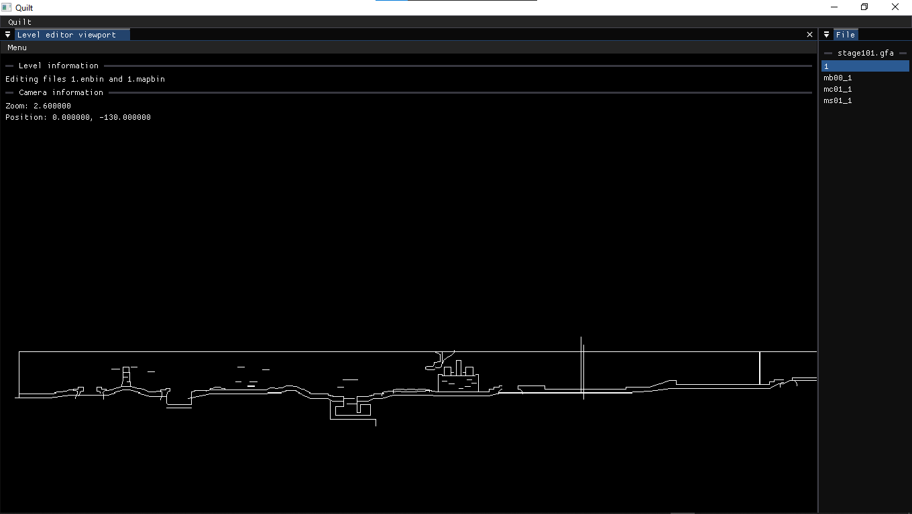

# Quilt
A <em>Kirby's Epic Yarn</em> (Wii) modding tool for various aspects of the game.

## Features
### Current Capabilities
- [X] Level Viewing
### Planned
- [ ] Level Editor
- [ ] Collision Editor
- [ ] GfArch Utility
### Roadmap
- [ ] MNEB Rendering
- [ ] BGST Rendering
- [ ] Pre-rendered BRRES models
- [ ] Potential <em>Kirby's Extra Epic Yarn</em> (3DS) support.

If you'd like to see a feature, make a request.

## Screenshots

## Dependencies
Before compiling Quilt, you will first need to download or compile the following libraries or files:

- [C++ JSON Parser](https://github.com/nlohmann/json)
- [ImGui docking branch](https://github.com/ocornut/imgui/tree/docking)
- [portable-file-dialogs](https://github.com/samhocevar/portable-file-dialogs)
- [SDL 2.0](https://github.com/libsdl-org/SDL)

Should you compile any source files yourself, place all objects into the `/lib/` folder. When prompted to move a header file into the project, create any folders that don't exist if necessary.

### C++ JSON Parser
> [!NOTE]
> This dependency is header-only. Move `json.hpp` to `include/lib/`.

### ImGui
> [!IMPORTANT]
> You must use the docking branch of ImGui.

> [!TIP]
> It's ideal to compile **ImGui** seperately, but you can skip this if you wish to compile it alongside Quilt.

Compile the following files:
- `imgui.cpp`
- `imgui_demo.cpp`
- `imgui_draw.cpp`
- `imgui_tables.cpp`
- `imgui_widgets.cpp`
- `backends/imgui_impl_sdl2.cpp`
- `backends/imgui_impl_sdlrenderer2.cpp`

Move the following header files into `include/lib/imgui/`:
- `imconfig.h`
- `imgui.h`
- `imgui_internal.h`
- `imstb_rectpack.h`
- `imstb_textedit.h`
- `imstb_truetype.h`
- `backends/imgui_impl_sdl2.h`
- `backends/imgui_impl_sdlrenderer2.h`

### portable-file-dialogs
> [!NOTE]
> This dependency is header-only. Move `portable-file-dialogs.h` to `include/lib/`.

Be sure to include any necessary libraries for the file dialogs. For example, Windows requires `ole32`, `comctl32`, `oleaut32`, and `uuid`.

### SDL2
Download SDL2 headers. Move them to `include/lib/SDL2/`.

Be sure that `SDL2.dll` (Windows) or an equivalent file is located in the same directory as the Quilt executable.
